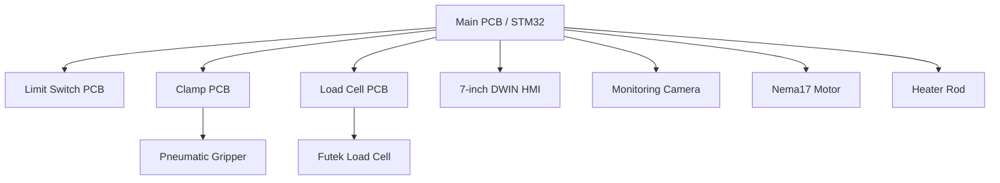
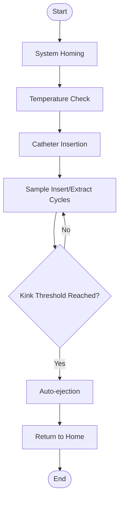

# 🛠️ Catheter Trackability Testing Machine — Firmware 🚀


---

## ✨ Tagline

Firmware for a precision catheter trackability testing machine with real-time monitoring and automated kink detection.

---

## 📑 Table of Contents

- [Overview](#overview)
- [Hardware System Architecture](#hardware-system-architecture)
- [Key Components Used](#key-components-used)
- [Features](#features)
- [System Workflow](#system-workflow)
- [Firmware Architecture](#firmware-architecture)
- [Installation & Setup Instructions](#installation--setup-instructions)
- [Usage Instructions](#usage-instructions)
- [PCB Design Notes](#pcb-design-notes)
- [Safety Notes / Precautions](#safety-notes--precautions)
- [Future Roadmap](#future-roadmap)
- [Contributing Guidelines](#contributing-guidelines)
- [License](#license)
- [Acknowledgements](#acknowledgements)
- [Footer / Links](#footer--links)

---

## 📝 Overview

The Catheter Trackability Testing Machine is designed to rigorously test catheter flexibility, kink resistance, and insertion/extraction force. It automates the process for repeatable, safe, and accurate results, featuring real-time monitoring via a touch HMI and integrated camera. The system ensures precise control and data logging for R&D and quality assurance in medical device development.

---

## 🏗️ Hardware System Architecture

The system is divided into four dedicated PCBs:

- **Main PCB (STM32-based):** Motor & heater control, HMI communication, camera interface, load cell data.
- **Limit Switch PCB:** Mechanical limit switch interfacing for homing/end-stop detection.
- **Clamp PCB:** Pneumatic catheter clamp/gripper control for insertion/extraction.
- **Load Cell PCB:** Signal conditioning & reading from Futek load cell via iAA100 driver.

### 📦 Block Diagram



---

## 🧩 Key Components Used

| Component                        | Role                                 | Notes                                 |
|-----------------------------------|--------------------------------------|---------------------------------------|
| STM32429I Discovery Board         | Main controller                      | STM32F429 MCU, high-speed, HMI comms  |
| iAA100 Futek Load Cell Driver     | Signal conditioning                  | For Futek load cell                   |
| Futek 1lb Load Cell               | Force measurement                    | Precision force sensing                |
| Nema17 Stepper Motor              | Catheter movement                    | High-torque, precise control           |
| Heater Rod                        | Track temperature control            | PID regulation                         |
| Limit Switches                    | Homing/end-stop detection            | Mechanical safety                      |
| 7” DWIN Touch HMI LCD             | User interface                       | Real-time GUI, parameter input         |
| Pneumatic Gripper                 | Catheter clamp/gripper               | Automated insertion/extraction         |
| Real-time Monitoring Camera       | Visual monitoring                    | Integrated into GUI                    |

---

## 🚀 Features

- **Manual Mode:** Motor forward/backward, heater ON/OFF, gripper open/close, homing.
- **Automatic Mode:** User sets insertion speed (mm/s), track temperature (°C), kink threshold force (N), insertion length (mm).
- Automated temperature regulation (PID heater control).
- Real-time GUI with temperature & force monitoring.
- Automated sample cycle (10mm insert + 10mm retract).
- Automatic catheter ejection on kink threshold.
- Camera feed integrated into GUI for live monitoring.
- Automatic homing after process completion.

---

## 🔄 System Workflow

1. **System Homing**
2. **Temperature Check & Heater Control**
3. **Catheter Insertion (force & temperature monitored)**
4. **Sample Insertion/Extraction Cycles**
5. **Auto-ejection on Kink Threshold**
6. **Return to Home Position**

### 🗺️ Workflow Diagram



---

## 🧠 Firmware Architecture

Modular STM32 firmware design:

- **Motor Driver**: Controls Nema17 stepper for precise movement.
- **Heater Controller**: PID loop for temperature regulation.
- **HMI Interface**: UART/SPI comms for GUI updates & user input.
- **Load Cell Reader**: I2C/SPI for force data acquisition.
- **Gripper Controller**: Pneumatic clamp actuation.

### Example: Homing Routine (C pseudocode)

```c
void home_system() {
	while (!limit_switch_triggered()) {
		move_motor_backward();
	}
	stop_motor();
	set_position_zero();
}
```

---

## 🛠️ Installation & Setup Instructions

1. **Development Environment:**
   - Install [STM32CubeIDE](https://www.st.com/en/development-tools/stm32cubeide.html)
   - Required toolchains: ARM GCC, STM32 HAL libraries
2. **Dependencies:**
   - STM32 HAL, UART/SPI/I2C drivers
3. **Flashing Firmware:**
   - Connect STM32 via ST-Link
   - Build & flash using STM32CubeIDE
4. **Hardware Connections:**
   - Connect PCBs via designated headers
   - Attach sensors, HMI, camera, gripper, load cell

---

## 📖 Usage Instructions

### Manual Mode
1. Power on system
2. Use HMI to control motor, heater, gripper
3. Monitor force & temperature in GUI

### Automatic Mode
1. Set parameters (speed, temp, force, length) via HMI
2. Start auto cycle
3. Monitor live camera feed & data

#### GUI Screenshots
> 

---

## 🖥️ PCB Design Notes

<details>
<summary><strong>Main PCB</strong></summary>

- STM32F429 core, connectors for all peripherals
- Signal routing for motor, heater, HMI, camera
- Safety: ESD protection, fuse on power input
- 
</details>

<details>
<summary><strong>Limit Switch PCB</strong></summary>

- Mechanical switch inputs, debounce circuitry
- Connector: 4-pin header
- 
</details>

<details>
<summary><strong>Clamp PCB</strong></summary>

- Pneumatic solenoid driver, feedback circuit
- Connector: 6-pin header
- 
</details>

<details>
<summary><strong>Load Cell PCB</strong></summary>

- iAA100 driver, analog signal conditioning
- Connector: 5-pin header
- 
</details>
---

## 🖼️ PCB Images & Details

<div align="center">


**Load Cell PCB**  
High-precision analog signal conditioning for Futek load cell. Features iAA100 driver, robust connectors, and shielded traces for noise immunity. Used for force measurement in catheter testing.

---


**Limit Switch PCB**  
Interfaces with mechanical limit switches for homing and end-stop detection. Includes debounce circuitry and secure connectors for reliable operation and safety.

---


**Clamp PCB**  
Controls pneumatic solenoid for catheter clamping and extraction. Features feedback circuit, robust power handling, and clear signal routing for precise actuation.

---


**Main PCB**  
STM32F429-based main controller board. Manages all system operations including motor and heater control, HMI and camera interfacing, and load cell data processing. Features robust connectors, power management, and safety protections.

</div>

---

## ⚠️ Safety Notes / Precautions

- Handle heater and pneumatic systems with care (risk of burns, pinch points)
- Calibrate load cell before use
- Ensure emergency stop is accessible and functional
- Disconnect power before servicing

---

## 🚧 Future Roadmap

- Wireless monitoring & control
- Cloud data logging
- AI-driven kink detection
- Enhanced GUI (graphing, analytics)
- Modular multi-catheter support

---

## 🤝 Contributing Guidelines

1. Fork the repository
2. Create a feature branch (`feature/your-feature`)
3. Commit with clear messages
4. Submit a pull request
5. Follow code style (C99, Doxygen comments)
6. Documentation: Use Markdown, keep diagrams up to date

---

## 📄 License

This project is licensed under the [MIT License](LICENSE).

---

## 🙏 Acknowledgements

- [Futek](https://www.futek.com/) — Load cell & driver
- [STMicroelectronics](https://www.st.com/) — STM32 platform
- [DWIN](https://www.dwin.com/) — HMI LCD
- Open-source contributors & libraries

---

## 🔗 Footer / Links

- [Repository](https://github.com/AliHassan-019/Catheter-Trackability-Testing-Machine-PCB)
- [Issue Tracker](https://github.com/AliHassan-019/Catheter-Trackability-Testing-Machine-PCB/issues)
- [Discussions](https://github.com/AliHassan-019/Catheter-Trackability-Testing-Machine-PCB/discussions)
- Academic citation: `Author, Project Title, GitHub, Year`
